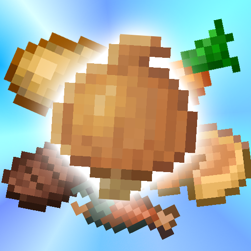

	

This fork requries <a href="https://modrinth.com/mod/creativecore">CreativeCore</a>.

A mod designed to encourage dietary variety! This project is a fork of Spice of Life: Sweet Potato Edition >> Spice of Life: Potato Edition >> Spice of Life: Carrot Edition. Potato and Carrot Edition share the same goal of rewarding the player for eating a variety of food. However, there are two main differences:

* Rather than permanently giving the player max health when they eat a new food, Potato Edition gives variable benefits depending on how diverse the player's current diet is. So if the player receives benefits for eating a bunch of new foods, they have to maintain that level of diversity to keep those benefits. This is to encourage automation of a variety of food production systems, rather than encouraging the player to eat each food once.
* The benefits for dietary diversity are completely customizable and not just limited to max health. Benefits can be modifiers of any attribute like max health, attack damage, armor, movement speed, etc., or any potion effect, from vanilla or any mod. The thresholds for acquiring benefits, the exact calculation for food diversity, how much any individual food contributes to diversity, and more are all configurable.
Basically, instead of using the carrot, it used the potato! Whatever that means...

Spice of Life Onion aims to port Potato Edition to Minecraft 1.20+, and eventually also include functionality from the original Spice of Life, plus maybe some of my own additions.

<a href="https://github.com/CreativeMD/Spice-of-Life-Onion/blob/1.20/GitHub/solsweetpotato-server.toml">Example config here</a>

Note that there are no dependencies for this mod, but <a href="https://modrinth.com/mod/attributefix">AttributeFix</a> is necessary if you want certain attributes to go above the default maximum limit.

# Features
This mod keeps track of the past 32 (configurable) foods you've eaten, and assigns a diversity score based on how diverse those foods are. The greater the variety of foods you've eaten, the higher your diversity score is, with a greater weight on recently eaten foods. You are then given various benefits depending on how high your current diversity score is.

Note that this means your diversity score is constantly and dynamically changing depending on what your current and past diet looks like. Thus, you can have a lot of benefits after eating a bunch of different foods, but if you go back to eating only bread, you will gradually lose all of your benefits. To get higher diversity scores, you need to keep including more and more different types of foods in your diet.

The exact computation of the diversity score is fairly involved, but I've included a description in the wiki. The method of computation is also very configurable, along with what benefits the player receives and at what diversity threshold they will receive those benefits. Please read the wiki to see exactly what the config does and how to change it.

By default, this mod gives you more max health the more diverse your diet is. Also by default, for increasingly high levels of diversity, you can receive permanent speed, strength, regeneration, and armor toughness bonuses (as long as you maintain that diverse diet).

The ceiling for maxing out your diversity is very high (and can be configured to be even higher), so if there are tons of different foods from various mods, such as HarvestCraft, there will always be an incentive to automate every type of food, no matter how much you have already automated. No more having a set of staple foods and never having any incentive to branch out! No more making a complex dish or hunting exotic game only to realize you don't have any incentive to make it ever again!

# Items
**Food Book** - The food book gives you all the information you need to know, including your current diversity score, all of the foods you've eaten in the past that are currently contributing to your diversity, and what benefits you have unlocked and can unlock. The food book GUI can also be accessed with a hotkey (unbound by default), if you don't want to carry around a physical item.

**Lunchbag and Lunchbox** - That's right, the lunchbag and lunchbox from the original Spice of Life are back! They function similarly, by holding food items and automatically selecting the food that will give you the maximum diversity increase (or the minimum diversity loss).

# Commands
This mod also features 3 commands:

* **/solonion diversity**
Tells you your current diversity score. The score is easily accessed with the Food Book, but this offers another convenient way to do it.
* **/solonion clear**
Clears the stored list of foods a player has eaten and resets their benefits. This is useful for testing when editing the config or when you want to start over.
* **/solonion sync**
Forces a sync of the food list to the client, for when something went wrong and it's mismatched.
# FAQs
* For earlier versions, try <a href="https://www.curseforge.com/minecraft/mc-mods/spice-of-life-sweet-potato-edition">Sweet Potato Edition</a>.
* Read the config, then read the wiki if you are still unsure.
# Credits
* Thanks to tarinoita for creating <a href="https://www.curseforge.com/minecraft/mc-mods/spice-of-life-sweet-potato-edition">Spice of Life Sweet Potato Edition</a>
* Many thanks to Kevun1 for creating the original <a href="https://github.com/Kevun1/Spice-of-Life-Potato-Edition">Spice of Life: Potato Edition</a>, my personal favorite Spice of Life variant and a must-have for any of my servers, alongside Pam's Harvestcraft or Farmer's Delight.
* Thanks also to Cazsius, Julian, and everyone that contributed to <a href="https://github.com/Cazsius/Spice-of-Life-Carrot-Edition">Spice of Life: Carrot Edition</a>, which the original Potato Edition was forked from.
